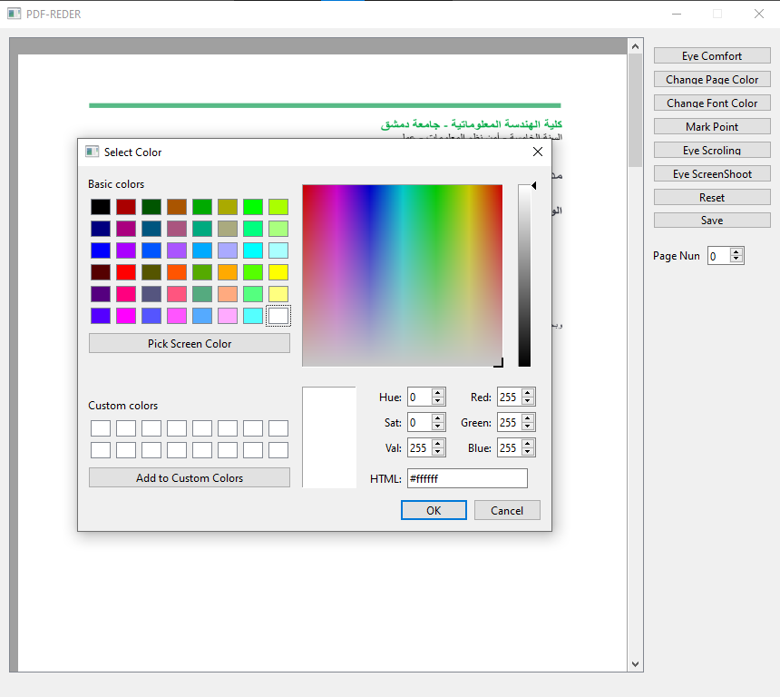

# PDF-Reader\Editor
___
### This project is aimed at read .pdf files,read pdfs files in eye comfort mode, edit their page color, font color, put mark where you are reading, take screen-shot with winking
### You can just drag&drop files to start.
___
### Technologies
#### Project is created with:
* python version: 3.8
* numpy version: 1.21.2
* opencv-python version: 4.5.4.60
* pdf2image version: 1.16.0
* PyQt6 version: 6.2.0
* PySide6 version: 6.2.2.1
* PyAutoGUI version: 0.9.53
* popple c/c++ version: 21.11.0
___
### Screenshots

